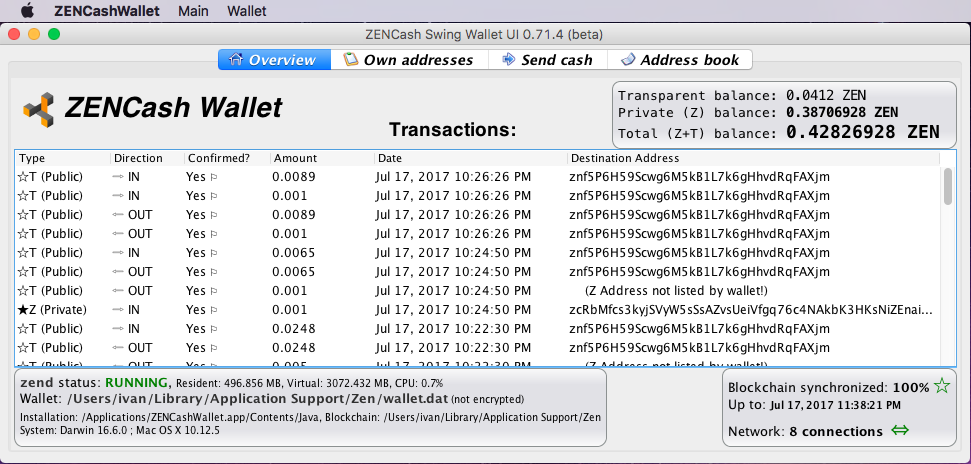

## [ZENCash](https://zensystem.io/) Desktop GUI Wallet binary release 0.71.4a for Mac OS

This is a [ZENCash](https://zensystem.io/) Desktop GUI Wallet binary release 0.71.4a for Mac OS. 
It includes [ZENCash 2.0.9-4 binaries](https://github.com/ZencashOfficial/zen/releases/tag/v2.0.9-4) 
by [@cronicc](https://github.com/cronicc). 

**This release contains the ZenCash [Mandatory Software Upgrade](https://blog.zensystem.io/zencash-hard-fork-at-block-139200-on-friday-july-21th-1400-edt/) at Block 139,200 on Friday July 21th 14:00 EDT**



### Installing the ZENCash Desktop GUI Wallet on Mac OS

1. Download the Wallet image file 
[ZENCashWallet-0.71.4a.dmg](https://github.com/vaklinov/zencash-swing-wallet-ui/releases/download/0.71.4/ZENCashWallet-0.71.4a.dmg). 

2. Security check: You may decide to run a virus scan on it before proceeding... In addition using a tool 
such as [http://quickhash-gui.org/](http://quickhash-gui.org/) you may calculate the its SHA256 checksum. The 
result should be:
```
32cab9e88d1f96fe6eca21693a302d613651370d4636e7a7aa093ad9dda6e983  ZENCashWallet-0.71.4a.dmg
```
**If the resulting checksum is not `32cab9e88d1f96fe6eca21693a302d613651370d4636e7a7aa093ad9dda6e983` then**
**something is wrong and you should discard the downloaded wallet!**

3. You need to (at least temporarily) allow the installation of "apps downloaded from anywhere" on your Mac. 
[This article](http://osxdaily.com/2016/09/27/allow-apps-from-anywhere-macos-gatekeeper/) is a good description
of how to do this. This step will not be necessary in future releases. 

4. Install the wallet like any other downloaded Mac OS application: Open the disk image `ZENCashWallet-0.71.4a.dmg`
and copy the ZENCashWallet application to the Applications folder. You can then discard the disk image.
   
### Running the ZENCash Desktop GUI Wallet on Mac OS

Simply click on ZENCashWallet in the Mac OS application launchpad.

### Disclaimer

THE SOFTWARE IS PROVIDED "AS IS", WITHOUT WARRANTY OF ANY KIND, EXPRESS OR
IMPLIED, INCLUDING BUT NOT LIMITED TO THE WARRANTIES OF MERCHANTABILITY,
FITNESS FOR A PARTICULAR PURPOSE AND NONINFRINGEMENT. IN NO EVENT SHALL THE
AUTHORS OR COPYRIGHT HOLDERS BE LIABLE FOR ANY CLAIM, DAMAGES OR OTHER
LIABILITY, WHETHER IN AN ACTION OF CONTRACT, TORT OR OTHERWISE, ARISING FROM,
OUT OF OR IN CONNECTION WITH THE SOFTWARE OR THE USE OR OTHER DEALINGS IN THE
SOFTWARE.

### Known issues and limitations
1. Issue: GUI data tables (transactions/addresses etc.) allow copying of data via double click but also allow editing. 
The latter needs to be disabled. 
1. Limitation: The list of transactions does not show all outgoing ones (specifically outgoing Z address 
transactions).  
