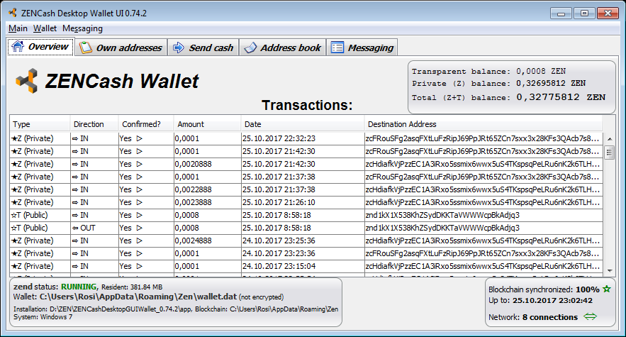

## [ZENCash](https://zensystem.io/) Desktop GUI Wallet binary release 0.74.2 for Windows

This is a [ZENCash](https://zensystem.io/) Desktop GUI Wallet binary release 0.74.2 for Windows. 
It requires a 64-bit Windows 7 or later version to run. It includes [ZENCash 2.0.10 binaries](https://github.com/ZencashOfficial/zen/releases/tag/v2.0.10)

Notable new features include messaging interface improvements for group messaging and ignoring/filtering contacts. 



### Installing the ZENCash Desktop GUI Wallet on Windows

1. Download the Wallet ZIP file 
[ZENCashDesktopGUIWallet_0.74.2.zip](https://github.com/ZencashOfficial/zencash-swing-wallet-ui/releases/download/0.74.2/ZENCashDesktopGUIWallet_0.74.2.zip). 

2. Security check: You may decide to run a virus scan on it, before proceeding... In addition using a tool 
such as [http://quickhash-gui.org/](http://quickhash-gui.org/) you may calculate the its SHA256 checksum. The 
result should be:
```
f64af29a8cb242056be0dcdf29cf6630991ea29242a0a4c284d71595f9e00e10  ZENCashSwingWalletUI_0.74.2.zip
```
**If the resulting checksum is not `f64af29a8cb242056be0dcdf29cf6630991ea29242a0a4c284d71595f9e00e10` then**
**something is wrong and you should discard the downloaded wallet!**

3. Unzip the Wallet ZIP file `ZENCashDesktopGUIWallet_0.74.2.zip` in some directory that it will run from.
   
### Running the ZENCash Desktop GUI Wallet on Windows

Double click on `ZENCashDesktopGUIWallet.exe`. On first run (only) the wallet will download the cryptographic keys 
(900MB or so). In case of problems logs are written in `%LOCALAPPDATA%\ZENCashSwingWalletUI\` for diagnostics.


### Disclaimer

THE SOFTWARE IS PROVIDED "AS IS", WITHOUT WARRANTY OF ANY KIND, EXPRESS OR
IMPLIED, INCLUDING BUT NOT LIMITED TO THE WARRANTIES OF MERCHANTABILITY,
FITNESS FOR A PARTICULAR PURPOSE AND NONINFRINGEMENT. IN NO EVENT SHALL THE
AUTHORS OR COPYRIGHT HOLDERS BE LIABLE FOR ANY CLAIM, DAMAGES OR OTHER
LIABILITY, WHETHER IN AN ACTION OF CONTRACT, TORT OR OTHERWISE, ARISING FROM,
OUT OF OR IN CONNECTION WITH THE SOFTWARE OR THE USE OR OTHER DEALINGS IN THE
SOFTWARE.

### Known issues and limitations
1. If a system has a high resolution monitor with DPI scaling enabled, not all GUI elements scale alike.
As a result the Wallet UI may feel inconvenient to use at scaling above 1.5x or even unusable at scaling above 3x.
This problem will be fixed in future versions.
1. Limitation: The list of transactions does not show all outgoing ones (specifically outgoing Z address 
transactions).  
