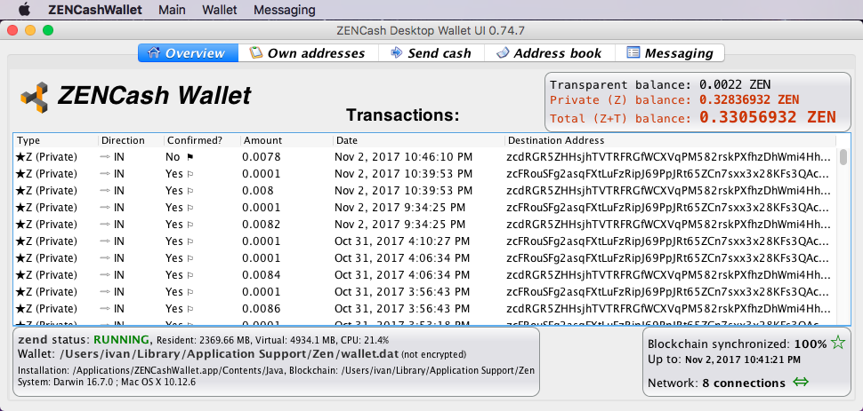

## [ZENCash](https://zensystem.io/) Desktop GUI Wallet binary release 0.74.7 for Mac OS

This is a [ZENCash](https://zensystem.io/) Desktop GUI Wallet binary release 0.74.7 for Mac OS. 
It includes [ZENCash 2.0.10 binaries](https://github.com/ZencashOfficial/zen/releases/tag/v2.0.10)
One notable new feature is the ability to send encrypted text messages in group conversations on the ZEN blockchain. It is also possible to block/ignore other users if they are spamming the conversation.



### Installing the ZENCash Desktop GUI Wallet on Mac OS

1. Download the Wallet image file 
[ZENCashWallet-0.74.7.dmg](https://github.com/ZencashOfficial/zencash-swing-wallet-ui/releases/download/0.74.7/ZENCashWallet-0.74.7.dmg). 

2. Security check: You may decide to run a virus scan on it before proceeding... In addition using a tool 
such as [http://quickhash-gui.org/](http://quickhash-gui.org/) you may calculate the its SHA256 checksum. The 
result should be:
```
b7ff9e45909ec2fd17cb3629a5212b902e06f3f8a41a9f2ea427d2025356b82e  ZENCashWallet-0.74.7.dmg
```
**If the resulting checksum is not `b7ff9e45909ec2fd17cb3629a5212b902e06f3f8a41a9f2ea427d2025356b82e` then**
**something is wrong and you should discard the downloaded wallet!**

3. You need to (at least temporarily) allow the installation of "apps downloaded from anywhere" on your Mac. 
[This article](http://osxdaily.com/2016/09/27/allow-apps-from-anywhere-macos-gatekeeper/) is a good description
of how to do this. This step will not be necessary in future releases. 

4. Install the wallet like any other downloaded Mac OS application: Open the disk image `ZENCashWallet-0.74.7.dmg`
and copy the ZENCashWallet application to the Applications folder. You can then discard the disk image.
   
### Running the ZENCash Desktop GUI Wallet on Mac OS

Simply click on ZENCashWallet in the Mac OS application launchpad.

### Disclaimer

THE SOFTWARE IS PROVIDED "AS IS", WITHOUT WARRANTY OF ANY KIND, EXPRESS OR
IMPLIED, INCLUDING BUT NOT LIMITED TO THE WARRANTIES OF MERCHANTABILITY,
FITNESS FOR A PARTICULAR PURPOSE AND NONINFRINGEMENT. IN NO EVENT SHALL THE
AUTHORS OR COPYRIGHT HOLDERS BE LIABLE FOR ANY CLAIM, DAMAGES OR OTHER
LIABILITY, WHETHER IN AN ACTION OF CONTRACT, TORT OR OTHERWISE, ARISING FROM,
OUT OF OR IN CONNECTION WITH THE SOFTWARE OR THE USE OR OTHER DEALINGS IN THE
SOFTWARE.

### Known issues and limitations
1. Limitation: The list of transactions does not show all outgoing ones (specifically outgoing Z address 
transactions).  
1. Limitation: if two users exchange text messages via the messaging UI TAB and one of them has a system clock, substantially running slow or fast by more than 1 minute, it is possible that this user will see text messages appearing out of order. 
1. Limitation: if a messaging identity has been created (happens on first click on the messaging UI tab), then replacing the `wallet.dat` or changing the node configuration between mainnet and testnet will make the identity invalid. This will result in a wallet update error. To remove the error the directory `~/.ZENCashSwingWalletUI/messaging` may be manually renamed or deleted (when the wallet is stopped). **CAUTION: all messaging history will be lost in this case!**
