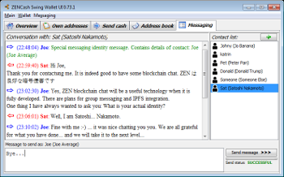
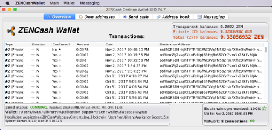
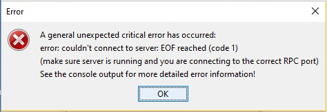

## [ZENCash](https://zensystem.io/) Desktop GUI Wallet troubleshooting guide

  

This document outlines possible solutions to several common problems that user might encounter while using the wallet.

### How to diagnose wallet problems

When wallet problems occur, the information about the errors that caused the issue is usually found in the log files written by the wallet itself and also by `zend`. The location of the wallet log files is:
```
Linux:    ~/.ZENCashSwingWalletUI/ZENCashGUIWallet_xxxx_xx_debug.log 
Windows:  %LOCALAPPDATA%/ZENCashSwingWalletUI/ZENCashGUIWallet_xxxx_xx_debug.log
macOS:   ~/Library/Application Support/ZENCashSwingWalletUI/ZENCashGUIWallet_xxxx_xx_debug.log
```
`zend` that is automatically started by the wallet, stores its logs at locations:
```
Linux:    ~/.zen/debug.log, 
Windows:  %APPDATA%/Zen/debug.log
macOS:   ~/Library/Application Support/Zen/debug.log
 ```
The log files are the first place to look for clues as to the nature of problem.

### Common Problem 1 - wallet fails during start up

This kind of problem may have multiple causes but the most frequent one in practice is that `zend` fails to start properly. The latter is in turn most commonly caused by block-chain corruption. This could occur 
in rare cases when for instance machines are stopped due to power disruptions, while `zend` is writing data.

A common symptom of this problem is an error message like:
 

The reason is usually that `zend` has not started properly and the GUI wallet cannot connect to it. As a start
one may examine the `zend` logs to find the technical details of the problem. One way to fix this problem, that 
works in 90%+ of cases is to start `zend` manually with a `-reindex` option from a terminal and start the GUI wallet only after that. The command is:
```
zend -reindex
```
For non-technical users here is some information on how to open a terminal on [Windows](https://www.lifewire.com/how-to-open-command-prompt-2618089) and [macOS](https://www.wikihow.com/Open-a-Terminal-Window-in-Mac). The full command on macOS is:
```
/Applications/ZENCashWallet.app/Contents/Java/zend -reindex
```
On Windows you first have to locate `zend.exe`. It is in the `/app` sub-directory of the wallet installation.

### Disclaimer

THE SOFTWARE IS PROVIDED "AS IS", WITHOUT WARRANTY OF ANY KIND, EXPRESS OR
IMPLIED, INCLUDING BUT NOT LIMITED TO THE WARRANTIES OF MERCHANTABILITY,
FITNESS FOR A PARTICULAR PURPOSE AND NONINFRINGEMENT. IN NO EVENT SHALL THE
AUTHORS OR COPYRIGHT HOLDERS BE LIABLE FOR ANY CLAIM, DAMAGES OR OTHER
LIABILITY, WHETHER IN AN ACTION OF CONTRACT, TORT OR OTHERWISE, ARISING FROM,
OUT OF OR IN CONNECTION WITH THE SOFTWARE OR THE USE OR OTHER DEALINGS IN THE
SOFTWARE.
